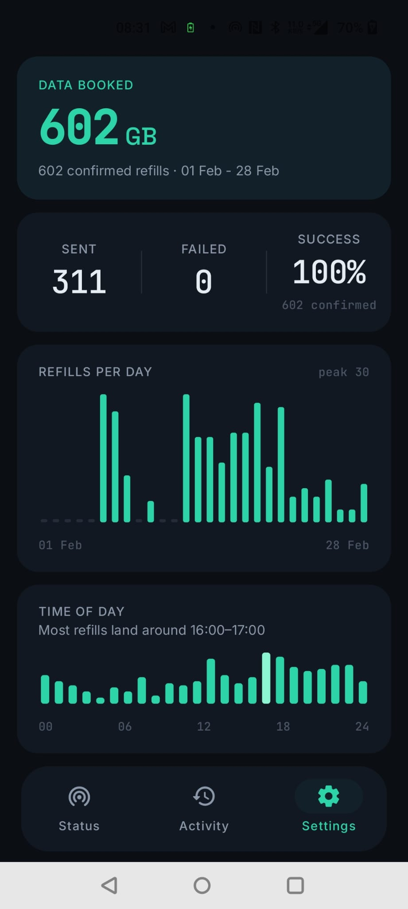
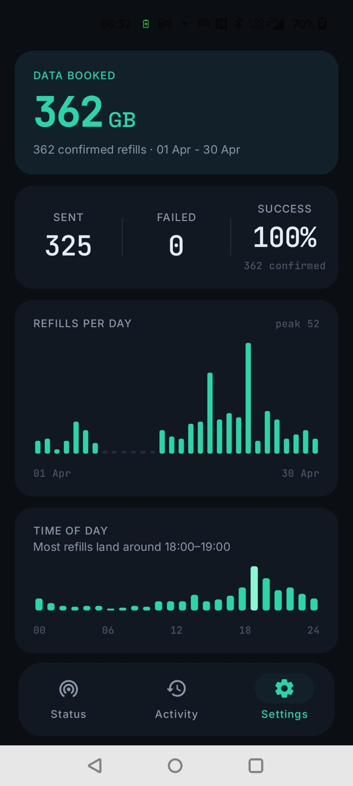
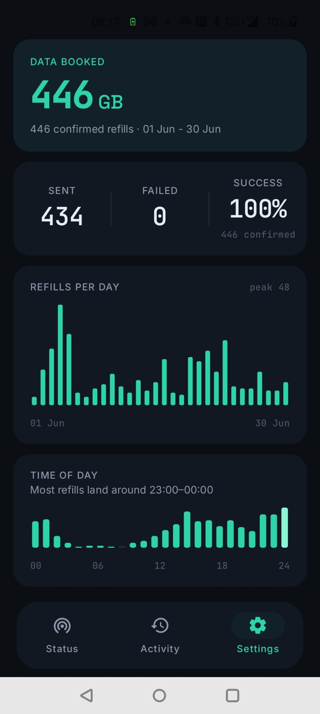

# Dataflow ULOD

**Nie wieder gedrosselt.** Dataflow ULOD bucht dein Lidl Connect Unlimited-Datenvolumen automatisch nach – auf Wunsch schon *bevor* gedrosselt wird. Einmal einrichten, nie wieder dran denken.

> Ich bin der Entwickler und ULOD ersetzt meinen Festnetz-Anschluss seit über sechs Monaten. Seit Februar: über 2 Terabyte gebucht, 2.158 automatische Nachbuchungen, null Fehler. Ich habe die App gebaut, weil ich sie jeden Tag brauche.

Mehr auf der [Website](https://dataflow-ulod-auto-refill.lovable.app) · [Instagram @dataflow.ulod](https://www.instagram.com/dataflow.ulod/)

---

## Download

**[⬇ Aktuelle APK herunterladen](https://github.com/Bashar101Kh/dataflow-ulod-releases/releases/latest/download/dataflow-ulod.apk)**

Dieser Link zeigt immer auf die neueste Version. Alle Versionen und Release Notes findest du auf der [Releases-Seite](https://github.com/Bashar101Kh/dataflow-ulod-releases/releases).

| Februar | April | Juni |
| --- | --- | --- |
|  |  |  |

*Echte Nutzung auf dem Gerät des Entwicklers – Heim-Internet-Ersatz seit über 6 Monaten. Februar 602 GB · März 438 GB · April 362 GB · Mai 310 GB · Juni 446 GB — **zusammen über 2 TB, 0 fehlgeschlagene Nachbuchungen.***

### Installation

1. APK auf dem Handy herunterladen.
2. Beim Öffnen fragt Android nach der Freigabe für Installationen aus dem Browser („Unbekannte Apps installieren") – einmal erlauben.
3. Dataflow ULOD öffnen und dem geführten Setup folgen: anmelden (Google oder E-Mail), SMS- und Benachrichtigungs-Berechtigungen erteilen, **Premium-SMS-Zugriff** auf *Immer erlauben* setzen und die App von der Akku-Optimierung ausnehmen.

Updates sind einfacher: Die App erkennt neue Versionen automatisch – eine neue APK über die alte installieren, alle Daten bleiben erhalten.

## Was die App macht

Beim Lidl Connect Unlimited-Tarif („ULOD") bekommst du 1 GB volle Geschwindigkeit am Stück – ist es verbraucht, wirst du gedrosselt, bis das nächste Gigabyte gebucht ist. Dataflow ULOD übernimmt das für dich, mit drei Modi:

- **SMS** – reagiert auf Lidls Status-SMS, sobald sie ankommt.
- **DATA** – die App misst deinen Verbrauch selbst und bucht das nächste Gigabyte *kurz vor* der 1-GB-Grenze – der gedrosselte Moment passiert einfach nie (Lidls Status-SMS kommt oft Minuten zu spät – hier wird nicht gewartet).
- **BEIDE** *(Standard)* – der Datenzähler führt, die SMS bleibt als Rückfallebene aktiv.

Dazu: Live-Verbrauchsanzeige, Sofort-Nachbuchung per Tipp, vollständiges Aktivitäts-Log und Statistiken (gebuchtes Volumen, Verlauf, Tageszeit-Analyse).

## Gut zu wissen (Ehrlichkeit zuerst)

Automatisierte Nachbuchungen könnten laut Community-Berichten gegen die Lidl Connect AGB verstoßen – Nutzung auf eigene Verantwortung. ULOD bucht nur, was du auch manuell buchen dürftest, und verhält sich bewusst zurückhaltend: standardmäßig erst bei Lidls früher Warnung, nur ein Paket auf einmal, keine Massenaktionen.

## Voraussetzungen

- Android 7.0 oder neuer
- Ein **Lidl Connect Unlimited**-Tarif (die 1-GB-Nachbuchungs-Option) auf einer aktiven SIM
- Die App ist während der öffentlichen Beta kostenlos

## Berechtigungen – und warum

| Berechtigung | Wofür die App sie braucht |
| --- | --- |
| SMS empfangen/lesen | Um Lidls Status-SMS („dein 1 GB ist verbraucht") und Buchungsbestätigungen zu sehen |
| SMS senden | Nachbuchungen laufen bei Lidl Connect über den SMS-Kanal – so erledigt die App ihre Arbeit für dich |
| Benachrichtigungen | Buchungsbestätigungen, Fehlermeldungen und der Überwachungsstatus |
| Hintergrundausführung | Der Datenzähler läuft als Foreground-Service, damit auch bei geschlossener App nachgebucht wird |

Alles rund um SMS bleibt **auf deinem Gerät**. Nachrichteninhalte werden niemals hochgeladen; nur dein Konto-Login und der Plan-Status kommunizieren mit unserem Backend.

## Warum nicht im Play Store?

Googles Play-Richtlinien erlauben die Art von SMS-Automatisierung nicht, auf der diese App aufbaut – unabhängig vom Zweck. Der Direkt-Download aus diesem Repository ist der offizielle und einzige Kanal. Wenn du diese APK woanders gefunden hast: nicht installieren.

### Download prüfen (optional, aber klug)

Jede Release-Notiz enthält die SHA-256-Prüfsumme der APK. Vergleichen mit:

```
certutil -hashfile dataflow-ulod.apk SHA256   # Windows
sha256sum dataflow-ulod.apk                   # Linux/Mac
```

## Support

Bug gefunden oder Frage? [Issue öffnen](https://github.com/Bashar101Kh/dataflow-ulod-releases/issues) oder in der App **Einstellungen → Über → Diagnose teilen** (der Bericht wird auf dem Gerät erstellt; nichts wird automatisch hochgeladen).

---

## English

**Never throttled again.** Dataflow ULOD automatically refills your Lidl Connect Unlimited data — optionally *before* you get throttled. Set it up once, never think about it again.

I'm the developer and ULOD has replaced my home internet for over six months. Since February: over 2 terabytes booked, 2,158 automatic refills, zero failures.

**[⬇ Download the latest APK](https://github.com/Bashar101Kh/dataflow-ulod-releases/releases/latest/download/dataflow-ulod.apk)** · [Website](https://dataflow-ulod-auto-refill.lovable.app) · [Instagram](https://www.instagram.com/dataflow.ulod/)

**How it works:** Lidl Connect Unlimited gives you 1 GB of full-speed data at a time. ULOD books the next gigabyte for you — in DATA mode even *just before* the 1 GB cliff, so the throttled moment never happens. Three trigger modes (SMS / DATA / BOTH), live usage gauge, activity log, statistics.

**Good to know:** according to community reports, automated refills could violate the Lidl Connect terms — use at your own risk. ULOD is deliberately restrained: by default it only refills at Lidl's early warning, one package at a time, no bulk actions.

**Privacy:** everything SMS-related stays on your phone. Message contents are never uploaded; only your account sign-in and plan status talk to our backend.

**Requirements:** Android 7.0+, a Lidl Connect Unlimited tariff on an active SIM. Free during the public beta. Not on the Play Store because Google's policies don't allow this kind of SMS automation — this repository is the official and only channel. Every release includes the APK's SHA-256 checksum.

---

*Dataflow ULOD ist ein unabhängiges Projekt und steht in keiner Verbindung zu Lidl, Lidl Connect oder der Schwarz Gruppe. „Lidl Connect" ist eine Marke ihres jeweiligen Inhabers. / Dataflow ULOD is an independent project, not affiliated with, endorsed by, or connected to Lidl, Lidl Connect, or Schwarz Gruppe.*
